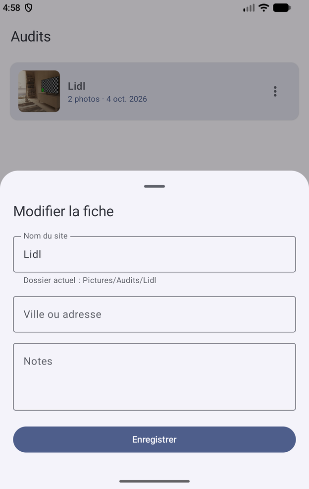
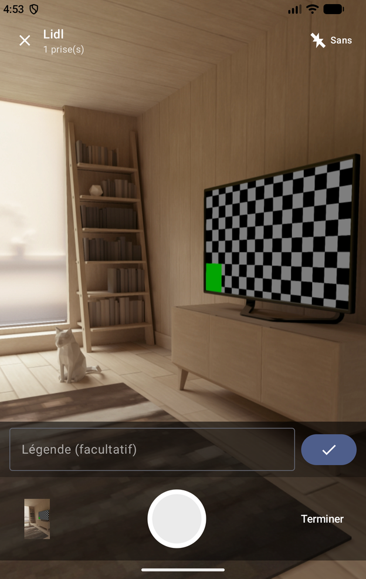
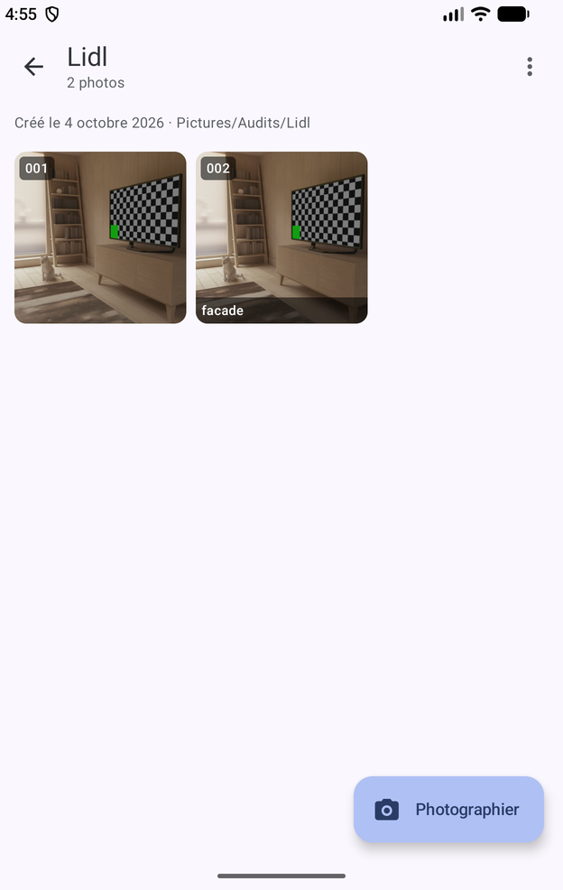
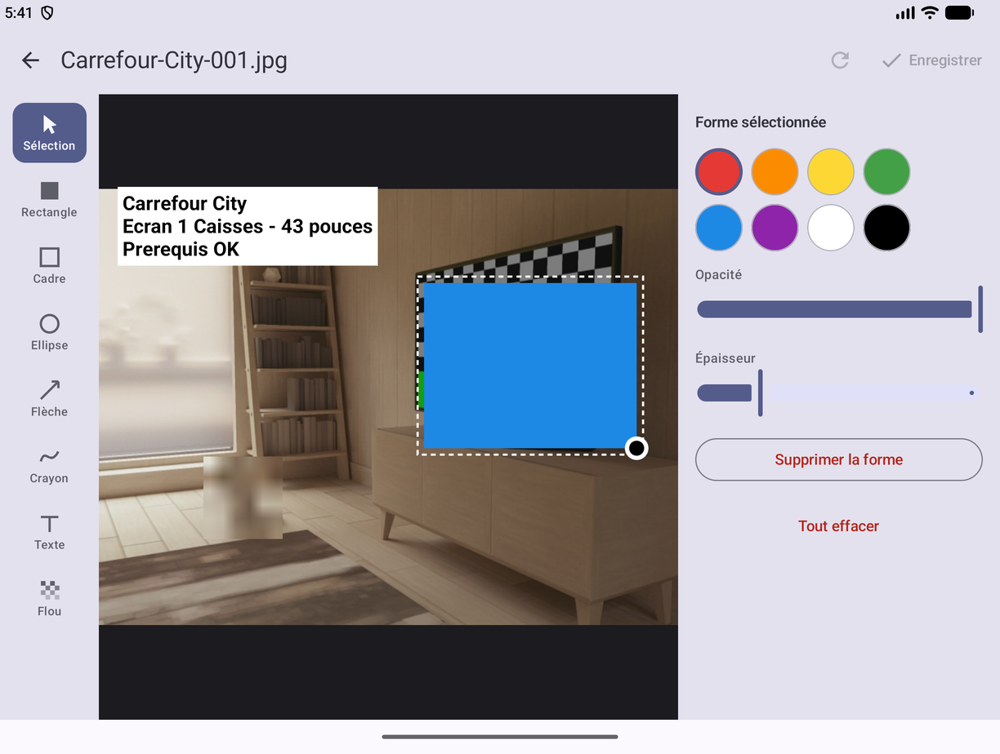
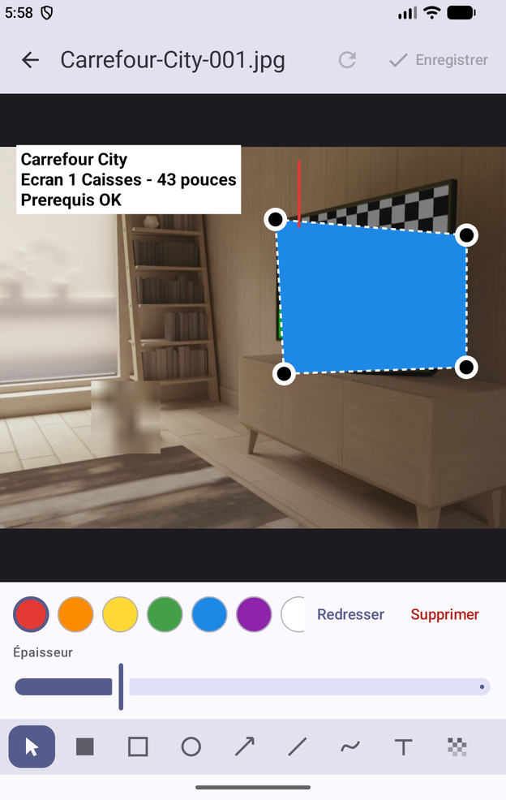
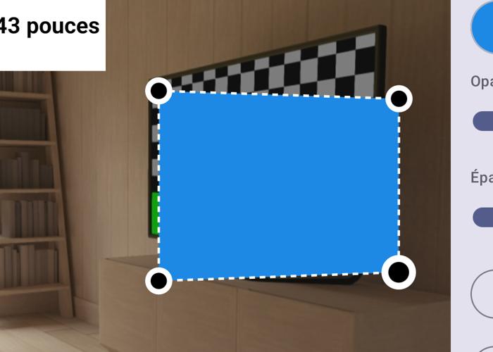
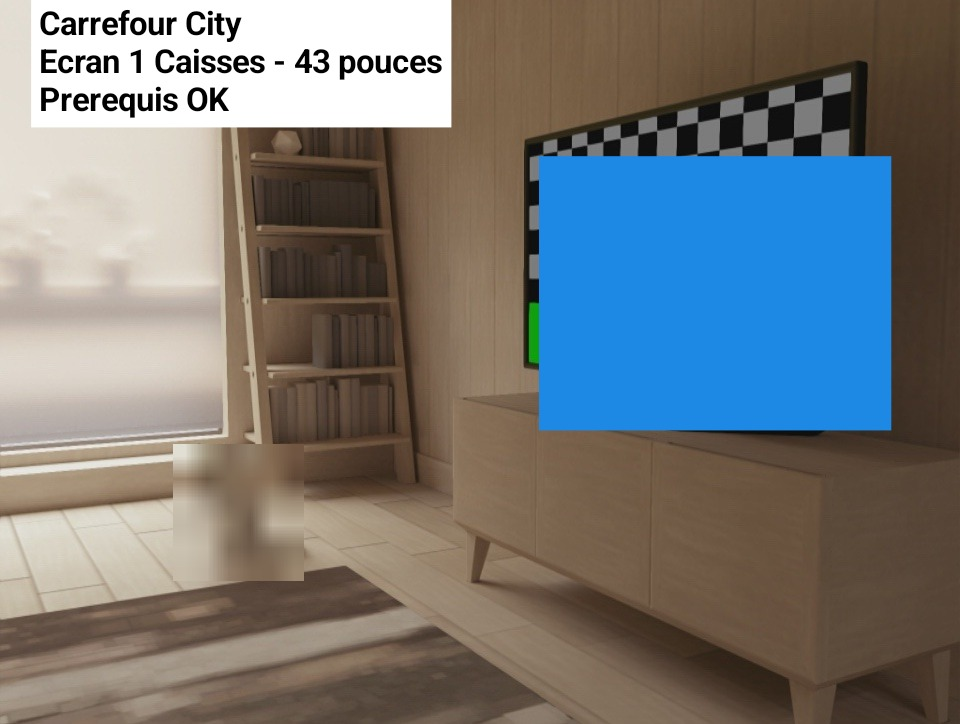

# Audit

Application Android pour photographier des relevés de terrain **en les rangeant au
moment de la prise de vue**, au lieu de les retrouver mélangés dans la pellicule le
soir venu.

Le cas qui l'a fait naître : des audits avant installation d'écrans PLV. Trois ou
quatre sites dans la journée, trente photos par site, et une galerie où plus rien ne
se distingue.

| Liste et fiche | Appareil photo | Les clichés de l'audit |
|---|---|---|
|  |  |  |

L'éditeur d'annotations, en écran déplié :



## Ce qu'elle fait

- Un **audit par site** : nom, ville ou adresse, notes libres. Créé en trois secondes,
  complété plus tard.
- Un **appareil photo intégré** : le cliché part directement dans le dossier de
  l'audit, sans passer par l'app photo du téléphone ni par un rangement manuel.
- Une **légende facultative** après chaque photo, qui rejoint le nom du fichier —
  `Lidl-Vitrolles-003-prise-elec.jpg` se comprend sans l'app.
- Un **vrai dossier** par audit, dans `Pictures/Audits/<site>` : visible en USB, dans
  l'explorateur de fichiers, et dans la galerie sous forme d'albums séparés.
- Un **éditeur d'annotations** : rectangle plein ou en contour, ellipse, flèche, trait,
  crayon, texte sur cartouche, et floutage pour masquer un visage ou un nom avant
  d'envoyer. Tout se déplace, se redimensionne et se recolore après coup.
- Les **rectangles se déforment librement par leurs quatre coins**, pour épouser un
  écran photographié de biais plutôt que de déborder d'un côté.
- L'**envoi** des photos ou d'un récapitulatif texte, par mail ou messagerie.

## Annoter

Depuis une photo ouverte, le crayon de la barre du haut. En écran déplié, les outils
passent en rail à gauche et les réglages à droite, la photo gardant le centre ; replié,
la même matière se replie en colonne sous l'image.



Chaque forme sélectionnée montre ses poignées. Sur un rectangle, elles vont où on les
met : l'aplat devient un quadrilatère quelconque et se cale sur l'objet, quelle que
soit la perspective. Un bouton « Redresser le cadre » rend le rectangle droit quand on
s'est emmêlé.



Ce qui sort dans le dossier de l'audit est la photo annotations comprises — personne
d'autre ne lira notre JSON :



## Les décisions qui ne se devinent pas à la lecture du code

**Le dossier ne suit pas les renommages de la fiche.** Corriger le nom d'un audit ne
déplace rien : des fichiers qui changent de place sans qu'on l'ait demandé cassent les
liens de ce qui a déjà été envoyé. Le déplacement existe, mais c'est une action
explicite du menu (« Aligner le dossier sur le nom »), qui déplace les photos *et*
réécrit leur préfixe.

**Les numéros de clichés ne sont jamais réutilisés.** Le compteur d'un audit est
réservé et persisté *avant* le déclenchement. Supprimer la photo 003 puis en prendre
une autre donne 004 : réutiliser le numéro donnerait deux fichiers homonymes dans le
même dossier, et MediaStore trancherait à notre place en suffixant « (1) ».

**Numérotation sur trois chiffres.** Pour que le tri alphabétique d'un explorateur de
fichiers soit l'ordre de la visite — c'est ce qui fait le compte-rendu.

**Annoter n'écrase pas l'original.** Le fichier visible porte les annotations gravées,
mais l'original part dans le stockage privé de l'app à la première retouche, et c'est
lui qu'on réannote à chaque passage. Redessiner les formes sur une image déjà annotée
les empilerait, et une faute de frappe deviendrait définitive. Le prix est connu : une
photo retouchée occupe deux fois sa place.

**Un rectangle déformé garde son cadre droit à jour**, comme boîte englobante de ses
quatre sommets. C'est ce cadre qui sert à attraper la forme au doigt : sans lui, un
quadrilatère tiré hors de ses limites d'origine resterait visible mais deviendrait
insélectionnable.

**Le coin opposé sert d'ancre, et il est figé au début du geste.** Recalculé à chaque
image, il se déplacerait dès qu'on traverse la forme, et le redimensionnement partirait
en vrille au lieu de se retourner proprement.

**Changer d'outil de tracé lâche la sélection.** La palette agit sur la forme
sélectionnée quand il y en a une ; sans cette règle, choisir « Trait » puis une couleur
repeignait la forme précédente au lieu de préparer la suivante. Trouvé en testant, pas
en relisant.

**Un trait est une flèche sans pointe** — même forme, mêmes gestes, un booléen de
différence. Une flèche désigne, un trait relie : la ligne d'accroche d'un écran
suspendu n'a rien à montrer du doigt.

**Les annotations sont en coordonnées normalisées**, de 0 à 1 par rapport à l'image.
Gardées en pixels, elles se décaleraient au premier changement d'écran — ouvrir déplié
ce qu'on a annoté plié suffirait.

**Un seul moteur de rendu.** L'aperçu de l'éditeur et le JPEG exporté passent par le
même code de dessin, sur un `android.graphics.Canvas` dans les deux cas. Deux moteurs
finiraient par diverger d'une police ici et d'un demi-pixel là, et ce qu'on enverrait au
client ne serait plus ce qu'on avait vu.

**L'orientation EXIF est appliquée avant d'annoter.** L'appareil photo écrit l'image
telle que la voit le capteur et note la rotation à côté ; sans la lire, une photo prise
en paysage s'annoterait couchée. Vérifié sur l'émulateur : original 724×960 avec
orientation 6, export 960×724 et annotations à l'endroit.

**Le flou est un sous-échantillonnage.** `RenderEffect` n'existe qu'à partir d'Android
12 et RenderScript est retiré ; réduire la zone puis la réétirer en filtré marche
partout et donne exactement ce qu'on cherche — un visage devenu illisible.

**Une seule permission : l'appareil photo.** Depuis Android 10, une app écrit dans les
collections partagées et relit ensuite ce qu'elle y a écrit, sans rien demander.
Réclamer `READ_MEDIA_IMAGES` donnerait accès à toute la galerie, et sur Android 14
l'utilisateur pourrait répondre « photos sélectionnées » — ce qui nous couperait
justement de nos propres dossiers.

**Le catalogue est un JSON, pas une base.** `audits.json` dans `filesDir` porte ce que
MediaStore ne sait pas dire : à quel audit appartient un cliché, et ce qu'il montre.
Quelques dizaines de fiches ; Room n'apporterait qu'un processeur d'annotations et une
migration à écrire au premier champ ajouté. Écriture par fichier temporaire renommé,
et un catalogue illisible est mis de côté plutôt qu'écrasé.

## Limites connues

- **Après une désinstallation**, l'app perd la propriété de ses entrées MediaStore et
  ne sait plus les relire : elle repart d'un catalogue vide. Les photos, elles, sont
  toujours dans `Pictures/Audits` — seules les légendes et les fiches sont perdues.
- **Aligner un dossier laisse l'ancien, vide, derrière lui.** Supprimer un répertoire
  dans une collection partagée demanderait une permission bien plus large que ce que
  justifie un dossier vide.
- **L'APK pèse 23 Mo en release** (31 en debug) parce que rien n'est minifié
  (`isMinifyEnabled = false`, comme sur les autres projets maison). Le poids est dans le
  code : 21,5 Mo de dex contre 0,18 Mo de bibliothèques natives — filtrer les ABI, piste
  évidente et vérifiée au dézippage, ne rapporterait rien.

## Installer sur le téléphone

```bash
./pousser.sh
```

Compile, installe et ouvre. Le téléphone se joint en **débogage sans fil** (Options de
développement), sur le même Wi-Fi que le poste : le script va chercher son annonce mDNS
et s'y connecte tout seul s'il n'est pas déjà joint. `./pousser.sh emu` vise
l'émulateur, `./pousser.sh tel debug` installe la variante de test à côté de l'app
réelle.

## Construire

```bash
./gradlew assembleRelease
```

L'APK signé sort dans `app/build/outputs/apk/release/`. La signature utilise
`cle-maison.jks`, le magasin partagé par les projets maison : sans lui, la build passe
mais l'app ne peut plus se mettre à jour par-dessus une version précédente.

`gradle.properties` épingle `org.gradle.java.home` sur le JDK 21 du système : Android
Studio 2026 embarque un JDK 25 que Gradle 8.11 ne sait pas lire, et la synchro échoue
alors sur un message vide.

## Vérifications

```bash
./gradlew test
```

52 tests JVM sur ce qui ne se contrôle pas à l'œil : la transcription des accents et
des caractères interdits dans les noms de dossiers, l'unicité des numéros de clichés à
travers un redémarrage, la relecture du catalogue, le récapitulatif, la géométrie des
annotations (rectangle tracé à l'envers, opacité changée sans toucher à la teinte, trait
mis à l'échelle sans se déplacer, sommet tiré qui ne bouge que lui, cadre englobant tenu
à jour) et la relecture de tous les types de formes en JSON polymorphe, quadrilatères
déformés compris.

Le reste a été vérifié sur émulateur Android 37, plié (1248×1972) et déplié
(2448×1848) : création d'un audit, octroi de la permission, prise de vue en rafale,
légende, renommage du fichier par la légende, déplacement d'un dossier complet,
suppression, puis annotation complète — rectangle, cartouche de texte, flou,
redimensionnement à la poignée, déformation d'un rectangle en quadrilatère,
enregistrement, ré-ouverture de l'éditeur pour vérifier que rien ne s'empile. Fichiers, entrées MediaStore et catalogue contrôlés à chaque
étape.
# Adit
# Adit
# Adit
